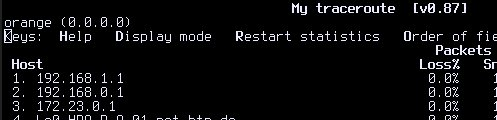

# lpc - large packet collider

The basic idea is simple. We try use NAT and network namespaces to create a routing loop.
The idea came up, where somebody decided that's a good idea to create a network with three
NATs consecutively:



Then we discussed, how we can create a network with a lot of NATs. Everyone knows, that
the level of goodness of IPv4 is defined by the number of NATs passed to the Internet.
We decided, that it would be the best idea to create a network with the level ∞.

So. Here we go! :smile:


## commands

**install lpc:**

``` shell
./lpc.sh
```

**start tcpdump:**

``` shell
ip netns exec m2 tcpdump -n -i veth1 icmp
```

**start a single ping:**

``` shell
ip netns exec m2 ping -c 1 8.8.8.8
```

**cleanup:**

``` shell
./lpc.sh cleanup
```

## step 1 - without ttlfix

Results:

```
root@orange /h/lemoer# ip netns exec m2 tcpdump -n -i veth1 icmp
tcpdump: verbose output suppressed, use -v or -vv for full protocol decode
listening on veth1, link-type EN10MB (Ethernet), capture size 262144 bytes
18:24:29.462053 IP 10.101.102.1 > 8.8.8.8: ICMP echo request, id 15984, seq 109, length 64
18:24:29.462071 IP 10.101.102.1 > 8.8.8.8: ICMP echo request, id 0, seq 109, length 64
18:24:29.462078 IP 10.101.102.1 > 8.8.8.8: ICMP echo request, id 1, seq 109, length 64
18:24:29.462085 IP 10.101.102.1 > 8.8.8.8: ICMP echo request, id 2, seq 109, length 64
18:24:29.462091 IP 10.101.102.1 > 8.8.8.8: ICMP echo request, id 3, seq 109, length 64
18:24:29.462097 IP 10.101.102.1 > 8.8.8.8: ICMP echo request, id 4, seq 109, length 64
18:24:29.462104 IP 10.101.102.1 > 8.8.8.8: ICMP echo request, id 5, seq 109, length 64
18:24:29.462112 IP 10.101.102.1 > 8.8.8.8: ICMP echo request, id 6, seq 109, length 64
18:24:29.462120 IP 10.101.102.1 > 8.8.8.8: ICMP echo request, id 7, seq 109, length 64
18:24:29.462127 IP 10.101.102.1 > 8.8.8.8: ICMP echo request, id 8, seq 109, length 64
18:24:29.462134 IP 10.101.102.1 > 8.8.8.8: ICMP echo request, id 9, seq 109, length 64
18:24:29.462141 IP 10.101.102.1 > 8.8.8.8: ICMP echo request, id 10, seq 109, length 64
18:24:29.462159 IP 10.101.102.1 > 8.8.8.8: ICMP echo request, id 12, seq 109, length 64
18:24:29.462166 IP 10.101.102.1 > 8.8.8.8: ICMP echo request, id 13, seq 109, length 64
18:24:29.462173 IP 10.101.102.1 > 8.8.8.8: ICMP echo request, id 14, seq 109, length 64
18:24:29.462181 IP 10.101.102.1 > 8.8.8.8: ICMP echo request, id 15, seq 109, length 64
18:24:29.462188 IP 10.101.102.1 > 8.8.8.8: ICMP echo request, id 16, seq 109, length 64
18:24:29.462195 IP 10.101.102.1 > 8.8.8.8: ICMP echo request, id 17, seq 109, length 64
18:24:29.462202 IP 10.101.102.1 > 8.8.8.8: ICMP echo request, id 18, seq 109, length 64
18:24:29.462209 IP 10.101.102.1 > 8.8.8.8: ICMP echo request, id 19, seq 109, length 64
18:24:29.462237 IP 10.102.103.3 > 10.101.102.1: ICMP time exceeded in-transit, length 92
```

## step 2 - ttlfix

As we saw in the last step, there the issue, that the ttl will exceed really
fast. So let's fix this:

``` shell
./ttl_fix.sh
```

Results:

```
root@orange /h/l/lpc# ip netns exec m2 tcpdump -n -i veth1 icmp
tcpdump: verbose output suppressed, use -v or -vv for full protocol decode
listening on veth1, link-type EN10MB (Ethernet), capture size 262144 bytes
18:47:53.529651 IP 10.101.102.1 > 8.8.8.8: ICMP echo request, id 18736, seq 1, length 64
18:47:53.529662 IP 10.101.102.1 > 8.8.8.8: ICMP echo request, id 30, seq 1, length 64
18:47:53.529669 IP 10.101.102.1 > 8.8.8.8: ICMP echo request, id 31, seq 1, length 64
18:47:53.529677 IP 10.101.102.1 > 8.8.8.8: ICMP echo request, id 32, seq 1, length 64
18:47:53.529683 IP 10.101.102.1 > 8.8.8.8: ICMP echo request, id 33, seq 1, length 64
18:47:53.529689 IP 10.101.102.1 > 8.8.8.8: ICMP echo request, id 34, seq 1, length 64
18:47:53.529695 IP 10.101.102.1 > 8.8.8.8: ICMP echo request, id 35, seq 1, length 64
18:47:53.529702 IP 10.101.102.1 > 8.8.8.8: ICMP echo request, id 36, seq 1, length 64
18:47:53.529708 IP 10.101.102.1 > 8.8.8.8: ICMP echo request, id 37, seq 1, length 64
18:47:53.529715 IP 10.101.102.1 > 8.8.8.8: ICMP echo request, id 38, seq 1, length 64
18:47:53.529721 IP 10.101.102.1 > 8.8.8.8: ICMP echo request, id 39, seq 1, length 64
18:47:53.529728 IP 10.101.102.1 > 8.8.8.8: ICMP echo request, id 40, seq 1, length 64
18:47:53.529734 IP 10.101.102.1 > 8.8.8.8: ICMP echo request, id 41, seq 1, length 64
18:47:53.529740 IP 10.101.102.1 > 8.8.8.8: ICMP echo request, id 42, seq 1, length 64
18:47:53.529746 IP 10.101.102.1 > 8.8.8.8: ICMP echo request, id 43, seq 1, length 64
18:47:53.529752 IP 10.101.102.1 > 8.8.8.8: ICMP echo request, id 44, seq 1, length 64
18:47:53.529758 IP 10.101.102.1 > 8.8.8.8: ICMP echo request, id 45, seq 1, length 64
18:47:53.529764 IP 10.101.102.1 > 8.8.8.8: ICMP echo request, id 46, seq 1, length 64
18:47:53.529771 IP 10.101.102.1 > 8.8.8.8: ICMP echo request, id 47, seq 1, length 64
18:47:53.529777 IP 10.101.102.1 > 8.8.8.8: ICMP echo request, id 48, seq 1, length 64
18:47:53.529783 IP 10.101.102.1 > 8.8.8.8: ICMP echo request, id 49, seq 1, length 64
18:47:53.529800 IP 10.101.102.1 > 8.8.8.8: ICMP echo request, id 50, seq 1, length 64
18:47:53.529806 IP 10.101.102.1 > 8.8.8.8: ICMP echo request, id 51, seq 1, length 64
18:47:53.529813 IP 10.101.102.1 > 8.8.8.8: ICMP echo request, id 52, seq 1, length 64
18:47:53.529819 IP 10.101.102.1 > 8.8.8.8: ICMP echo request, id 53, seq 1, length 64
18:47:53.529826 IP 10.101.102.1 > 8.8.8.8: ICMP echo request, id 54, seq 1, length 64
18:47:53.529832 IP 10.101.102.1 > 8.8.8.8: ICMP echo request, id 55, seq 1, length 64
18:47:53.529838 IP 10.101.102.1 > 8.8.8.8: ICMP echo request, id 56, seq 1, length 64
18:47:53.529845 IP 10.101.102.1 > 8.8.8.8: ICMP echo request, id 57, seq 1, length 64
18:47:53.529851 IP 10.101.102.1 > 8.8.8.8: ICMP echo request, id 58, seq 1, length 64
18:47:53.529857 IP 10.101.102.1 > 8.8.8.8: ICMP echo request, id 59, seq 1, length 64
18:47:53.529865 IP 10.101.102.1 > 8.8.8.8: ICMP echo request, id 60, seq 1, length 64
18:47:53.529871 IP 10.101.102.1 > 8.8.8.8: ICMP echo request, id 61, seq 1, length 64
...
```
[Read more...](results/with_ttl_fix.md)

